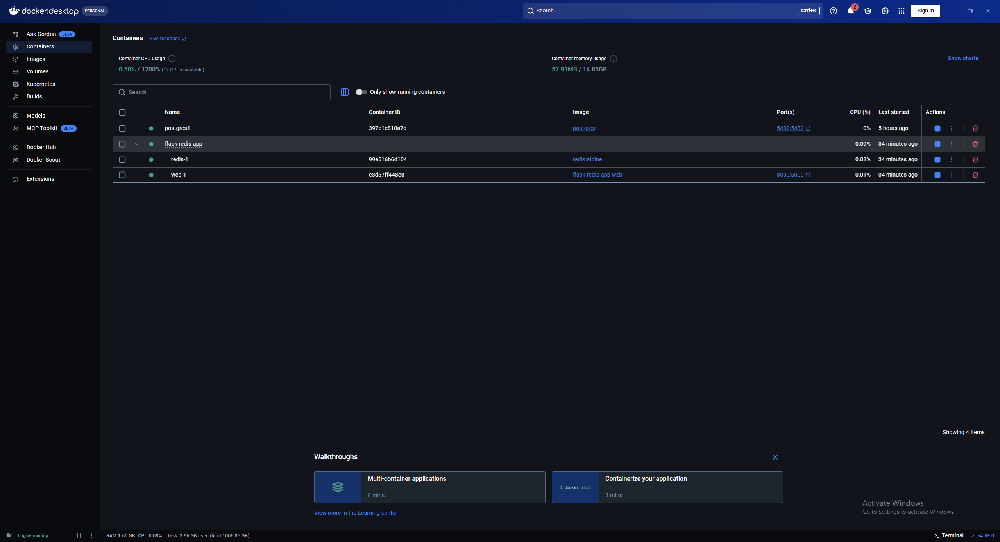
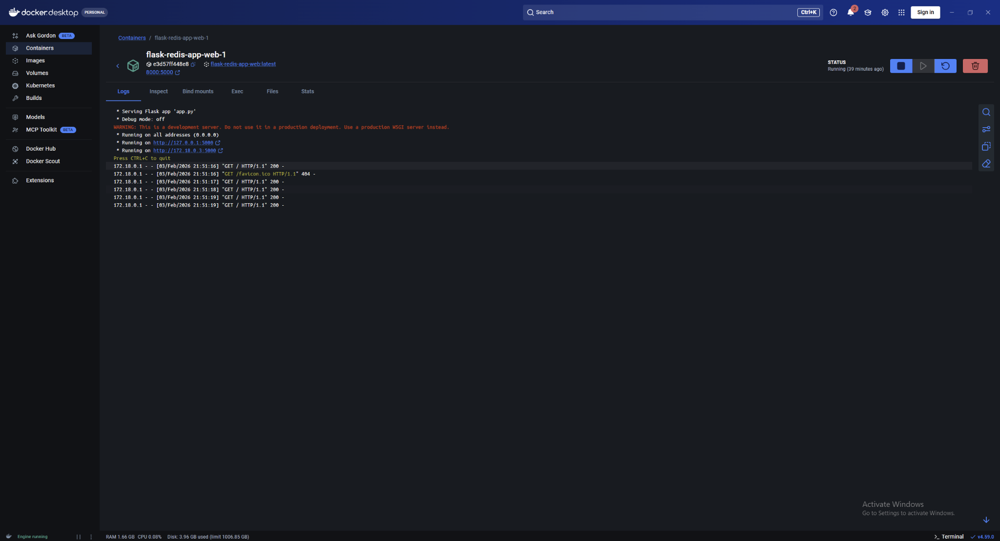
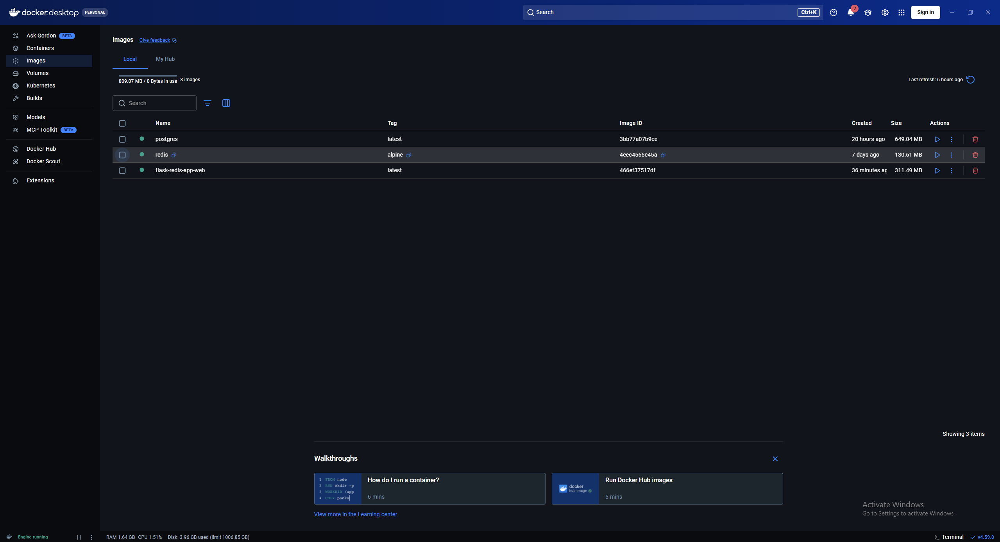
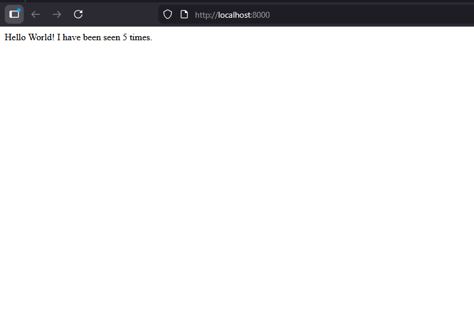
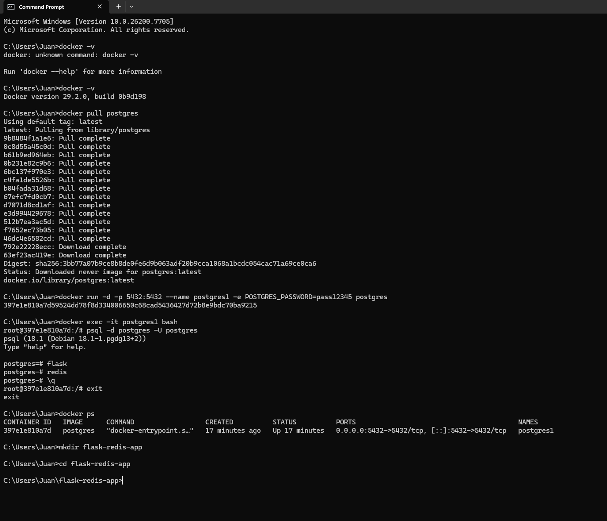
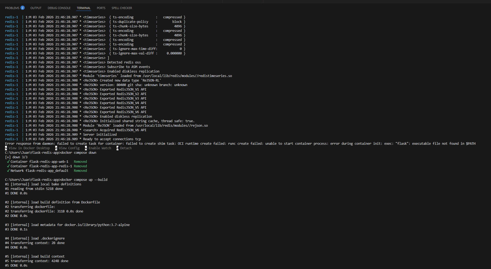

## Docker Containers Running

This screenshot shows the running Flask web container and Redis container in Docker Desktop.

---

## Flask Web App Logs

This image displays the Flask application logs confirming successful startup and HTTP requests.

---

## Docker Images

This screenshot shows the locally built Docker images, including the Flask application image.

---

## Application Output

This image confirms the Flask web application is accessible at `http://localhost:8000`.

---

## Initial Setup

This screenshot shows the initial Docker environment setup.

---

## First Build Error (Resolved)

This image captures an initial Docker build error that was resolved during development.
